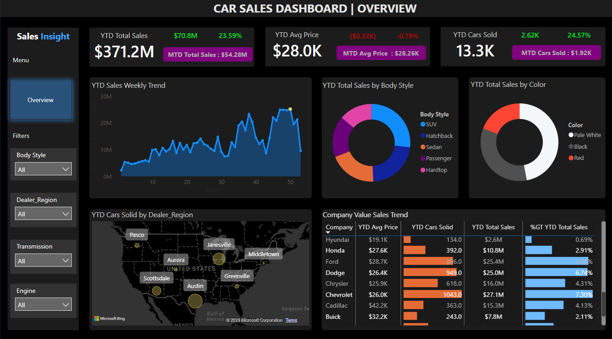
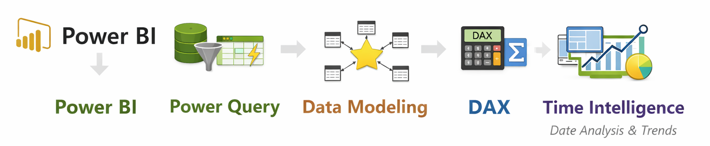
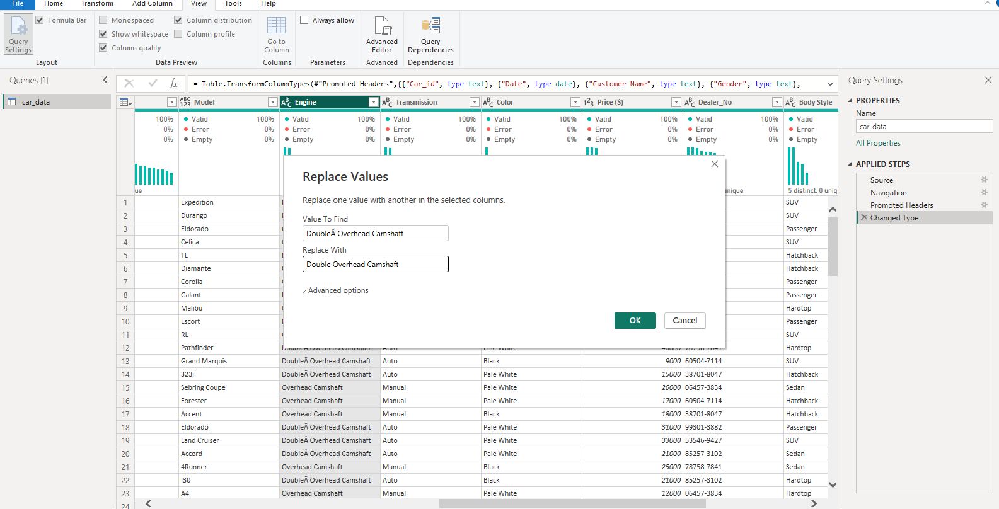
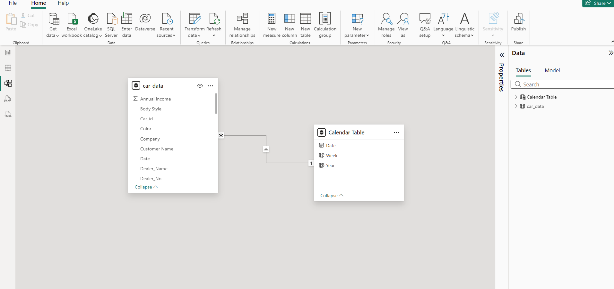
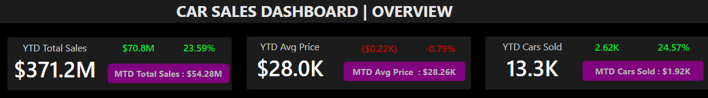
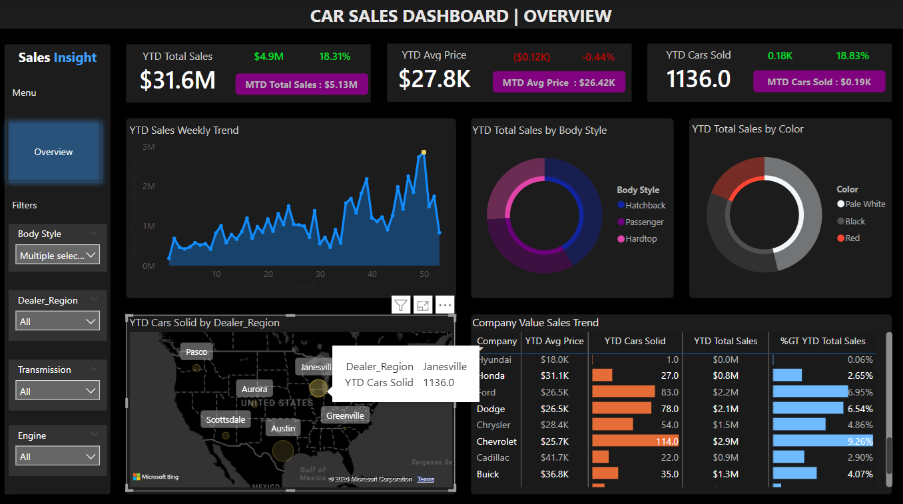

# 🚗 Car Sales Performance Analysis | Business Intelligence Project

# 📌 Project Overview

This project analyzes dealership sales performance to support executive decision-making through data-driven insights.

As a Business Analyst, the focus of this analysis was not just visualization — but identifying profitability risks, performance gaps, and strategic growth opportunities.

---

# ❗ Business Problem

The dealership lacked clear visibility into:

- Profitability by vehicle category
- Regional margin performance
- Impact of discounting on profit
- Seasonal sales fluctuations
- Year-over-year growth trends

Management needed a centralized performance dashboard to support strategic decisions around pricing, inventory, and regional operations.

---

# 🎯 Business Objectives

- Evaluate revenue vs profitability performance
- Identify underperforming regions
- Assess discount impact on margins
- Detect seasonal sales patterns
- Support data-driven strategic planning

---

# 🔄 Project Workflow (Start to Finish)

This project followed a structured Business Analysis workflow from data intake to strategic recommendations.

## 1️⃣ Data Understanding

- Reviewed dataset structure and available fields
- Identified key business metrics (Revenue, Profit, Units Sold, Date, Region, Vehicle Model)
- Defined analytical objectives aligned with business performance evaluation

At this stage, the focus was translating raw data into business questions.

---

## 2️⃣ Data Preparation (Power Query)

The dataset was already clean and structured.  
Power Query was used to:

- Replace inconsistent values
- Standardize categorical fields
- Prepare columns for accurate aggregation

This ensured data consistency before modeling and analysis.

---

## 3️⃣ Data Modeling (Star Schema)

A Star Schema model was designed to:

- Separate fact and dimension tables
- Establish primary and foreign key relationships
- Ensure correct aggregation logic
- Improve scalability and performance

This structure supports reliable KPI calculation and time-based analysis.

---

## 4️⃣ KPI Development (DAX)

DAX measures were created to calculate:

- Total Revenue
- Total Profit
- Profit Margin %
- Units Sold
- Year-to-Date (YTD) Sales
- Monthly Sales Trends

Time Intelligence functions were applied to analyze growth patterns and performance trends over time.

---

## 5️⃣ Dashboard Design & Reporting

An executive-focused dashboard was designed to:

- Highlight core KPIs at the top level
- Allow filtering by region, vehicle, and time
- Enable drill-down analysis
- Present clear visual comparisons

The layout was structured for decision-makers rather than technical users.

---

# 🛠 Tools Used

- Power BI
- Power Query
- DAX
- Data Modeling (Star Schema)
- Time Intelligence Functions

---

# 📊 KPI Framework

The dashboard was built around key executive metrics:

- Total Revenue
- Total Profit
- Profit Margin %
- Units Sold
- Year-to-Date (YTD) Sales
- Monthly Sales Trends

These KPIs allow leadership to evaluate growth while protecting profitability.

---

# 🔍 Business Insights

✔ High sales volume does not always translate to high profit  
✔ Some regions generate strong revenue but weak margins  
✔ Discount-heavy transactions reduce overall profitability  
✔ Sales performance follows seasonal trends  
✔ YTD growth is positive but margin stability varies  

---

# 💡 Business Strategic Recommendations

- Focus marketing efforts on high-performing body styles.
- Investigate underperforming regions and optimize dealer strategy.
- Adjust pricing strategies based on YOY average price trends.
- Strengthen partnerships with top-performing brands.
- Use weekly sales trends to improve forecasting accuracy
---
# 📬 Contact
**Tshedza Tshipuke**  
Aspiring Data Analyst  

- GitHub: https://github.com/Itspukke 
- LinkedIn: www.linkedin.com/in/tshedza-tshipuke-468516119

